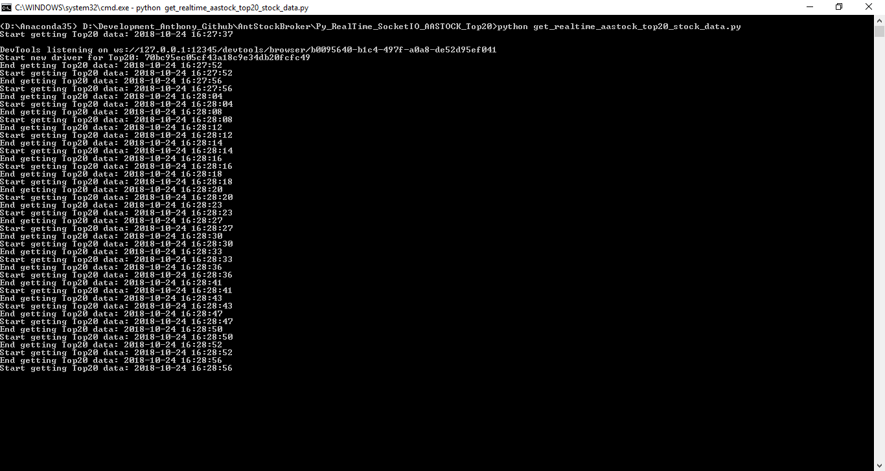

# Ant Stock Broker

## 1.AASTOCK Top 20 Stock List Data Real-Time Streaming 
AASTOCK Top 20 Stock List Data Real-Time Streaming (demo: https://www.youtube.com/watch?v=jsrTexhlBu4)  
Requirements:  
	mpl_finance==0.10.0  
	selenium==3.12.0  
	numpy==1.14.3    
	eventlet==0.23.0  
	Flask==1.0.2  
	dask==0.19.4  
	Flask_SocketIO==2.9.3  
	pandas==0.23.4  
	matplotlib==2.0.2  
	beautifulsoup4==4.6.3  

To get real-time AASTOCK Top 20 Stock List Data, run the following script  
	python get_realtime_aastock_top20_stock_data.py  

To display real-time AASTOCK Top 20 Stock List Data on web page, run the following script and navigate to http://localhost:5001  
	python app.py  

## 2.Real-Time MACD > EMA and MACD > 0
Real-Time Stock List with MACD > EMA and MACD > 0

## 3.Real-Time MACD > EMA and MACD < 0
Real-Time Stock List with MACD > EMA and MACD < 0

## 4.Real-Time Stock Chart
Real-Time Stock Chart Demo (https://www.youtube.com/watch?v=2asnITNytdQ)

